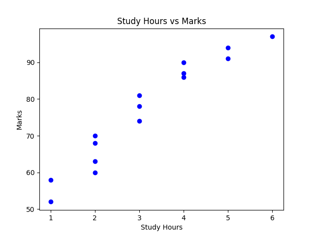
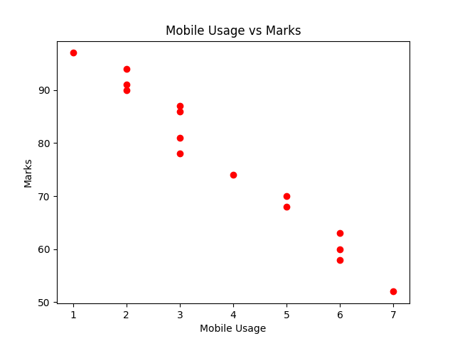
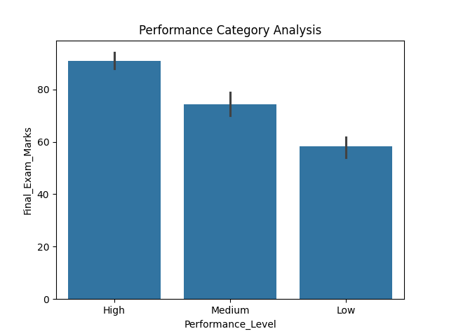
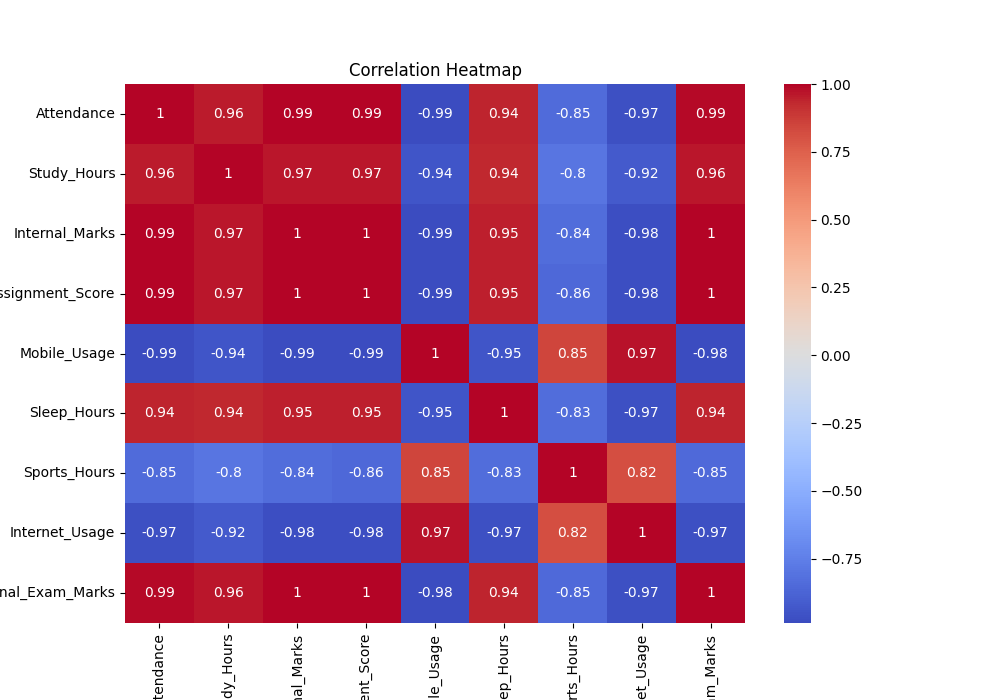
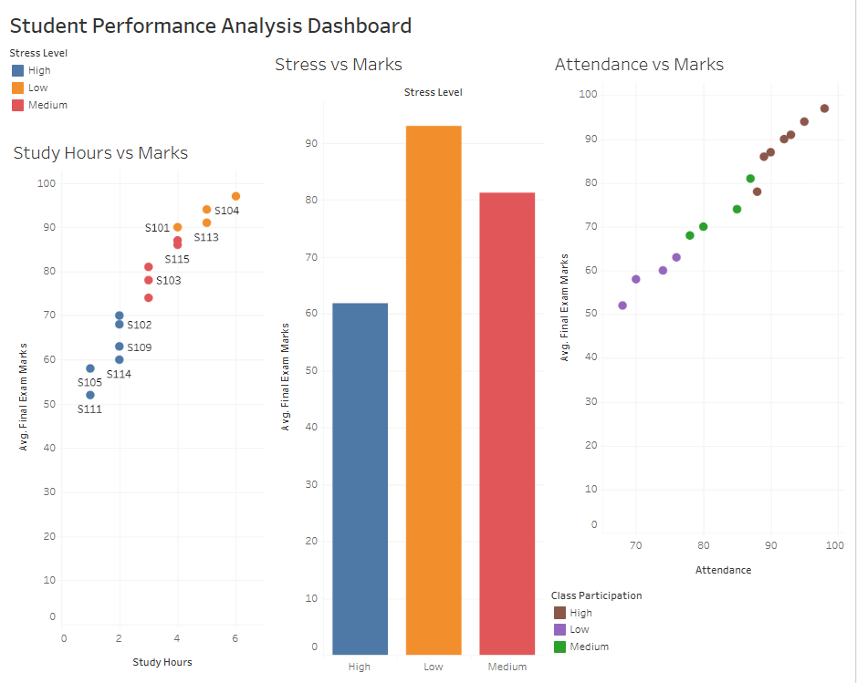

# 🎓 Student Performance Analysis Using Python & Tableau


---

## 📌 About This Project

A complete **Data-Driven Case Study** analyzing academic and lifestyle 
factors that affect student examination performance.

This project was built as part of a **HoT (Higher Order Thinking Skills) 
Based Case Study Assignment** for the subject **Data Analytics**.

---

## 🎯 Problem Statement

Student academic performance is influenced by multiple factors including:
- 📚 Study Hours
- 📱 Mobile Phone Usage
- 🏫 Attendance
- 😴 Sleep Hours
- 😰 Stress Level
- 💻 Internet Usage
- 🏃 Sports Activity

This project analyzes all these factors together and identifies 
which ones **positively or negatively** affect final exam marks.

---

## 🛠️ Tools & Technologies

| Tool | Purpose |
|------|---------|
| Python 3.11 | Core programming language |
| Pandas | Data loading, cleaning, analysis |
| NumPy | Numerical operations |
| Matplotlib | Scatter plots, bar charts |
| Seaborn | Heatmap, statistical plots |
| Tableau | Interactive dashboard |

---

## 📊 Dataset

- **File:** `student_data.csv`
- **Records:** 15 students
- **Attributes:** 12 columns

| Column | Description |
|--------|-------------|
| Student_ID | Unique identifier |
| Attendance | Attendance percentage |
| Study_Hours | Daily study hours |
| Internal_Marks | Internal assessment score |
| Assignment_Score | Assignment score |
| Mobile_Usage | Daily phone usage (hours) |
| Sleep_Hours | Average sleep hours |
| Sports_Hours | Sports activity hours |
| Internet_Usage | Daily internet usage |
| Stress_Level | Low / Medium / High |
| Class_Participation | Low / Medium / High |
| Final_Exam_Marks | Target variable |

---

## 🧠 HOTS Goals Covered

| Case Study | Challenge | HOTS Goal |
|------------|-----------|-----------|
| Data Cleaning | Consistency Checks | Evaluation |
| Derived Variables | Performance Level Flag | Design |
| Outlier Detection | Z-Score & Rolling Avg | Evaluation |
| Text Cleaning | Regex Pipeline | Creation |
| Heatmap | Correlation Visualization | Creation |
| KPI Analysis | Scatter Plot Matrix | Analysis |

---

## 📈 Key Findings

✅ **Study Hours ↑ → Marks ↑** (Strong positive correlation: 0.96)

❌ **Mobile Usage ↑ → Marks ↓** (Strong negative correlation: -0.98)

✅ **Attendance ↑ → Marks ↑** (Strongest correlation: 0.99)

✅ **Low Stress → Higher marks** (~93 avg vs ~61 for High stress)

✅ **Internal Marks** are the strongest predictor of final performance

---

## 📂 Project Structure
```
StudentPerformanceCaseStudy/
│
├── student_data.csv          # Dataset
├── analysis.py               # Main Python code
│
├── output_screenshots/
│   ├── scatter_study.png     # Study Hours vs Marks
│   ├── scatter_mobile.png    # Mobile Usage vs Marks
│   ├── bar_chart.png         # Performance Category
│   ├── heatmap.png           # Correlation Heatmap
│   └── dashboard.png         # Tableau Dashboard

```

---

## ▶️ How to Run

**1. Clone the repository**
```bash
git clone https://github.com/akalyatamilvel/StudentPerformanceCaseStudy
cd StudentPerformanceCaseStudy
```

**2. Install required libraries**
```bash
pip install pandas numpy matplotlib seaborn
```

**3. Run the analysis**
```bash
python analysis.py
```

**4. View outputs**
All charts will be saved in `output_screenshots/` folder automatically!

---

## 📊 Output Screenshots

### Study Hours vs Marks


### Mobile Usage vs Marks


### Performance Category Analysis


### Correlation Heatmap


---

## 🖥️ Tableau Dashboard

An interactive dashboard was built in Tableau featuring:
- 📊 Study Hours vs Marks (Scatter Plot)
- 📊 Stress Level vs Marks (Bar Chart)
- 📊 Attendance vs Marks (Scatter Plot)
- 🔽 Interactive filters by Stress Level & Class Participation


---

## 👩‍💻 Author

**Akalya Tamilvel Senbakam**
CSE AIML-A
Data Analytics — HoT Case Study Assignment

---

⭐ **If you found this useful, give it a star!** ⭐
